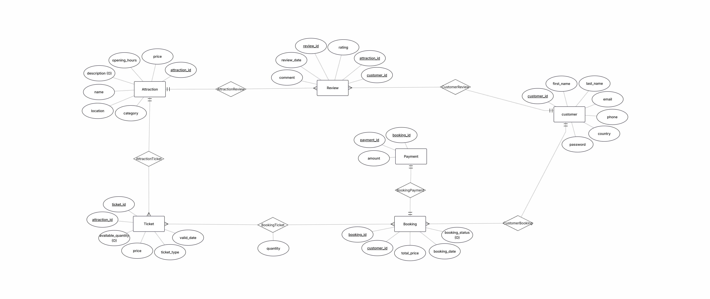
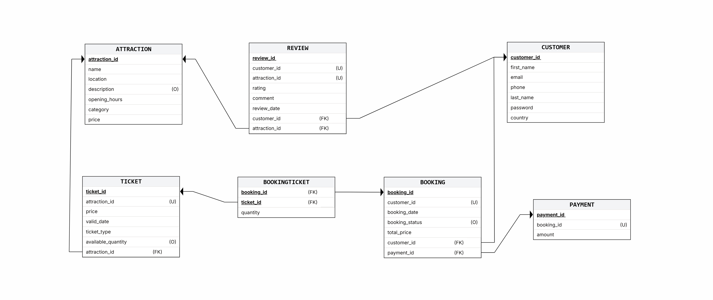

# AttraTicket: Attraction Booking System

## Project Information
**Prepared by:** Hadasa Esther Elbaz, Tamar Rozen
**System Name:** AttraTicket  
**Module:** Attraction Booking, Ticketing 

---

## Table of Contents
- [Stage 1: Design and Build the Database](#stage-1-design-and-build-the-database)
  - [Introduction](#introduction)
  - [AI-Generated Prototype](#ai-generated-prototype)
  - [Logical Design](#logical-design)
  - [Data Dictionary](#data)
  - [SQL Scripts](#sql-scripts)
  - [Backup & Recovery](#backup--recovery)
- [Stage 2: Queries, Constraints, Transactions, and Performance](#stage-2-queries-constraints-transactions-and-performance)
  - [Introduction](#introduction)
  - [Dual SELECT Queries](#dual-select-queries)
  - [Additional SELECT Queries](#additional-select-queries)
  - [DELETE Queries](#delete-queries)
  - [UPDATE Queries](#update-queries)
  - [Constraints](#constraints)
  - [Rollback and Commit Demonstrations](#rollback-and-commit-demonstrations)
  - [Indexes and Runtime Comparison](#indexes-and-runtime-comparison)

---

## Stage 1: Design and Build the Database

## Introduction
The **AttraTicket Database** is a booking and ticket management system for attractions.  
It connects customers, attractions, ticket inventory, bookings, payments, and reviews in one normalized relational schema.

#### Purpose of the Database
This database provides a reliable solution to:
- **Manage Customers:** registration details, contact information, and identity records.
- **Manage Attractions:** location, category, opening hours, descriptions, and base pricing.
- **Manage Ticketing:** ticket type, validity date, available quantity, and attraction linkage.
- **Manage Transactions:** booking records, payment linkage, and booking status.
- **Collect Feedback:** customer ratings and comments per attraction.
- **Enable Reporting:** perform SQL-based analysis over bookings, reviews, and attraction demand.

#### Potential Use Cases
- **Customers** can book attractions, purchase tickets, and submit reviews.
- **Business Managers** can analyze popular attractions and customer satisfaction.
- **Support Teams** can track booking/payment relationships and resolve issues quickly.
---

## AI-Generated Prototype
### System Screens
The system was planned using a **Top-Down approach** with UI characterization in Google AI Studio.

 **[Live Demo (AI Studio Link)](https://ai.studio/apps/22d49e6f-06a0-43ed-933f-a033e8c625c5)**


---

## Logical Design
### ERD (Entity-Relationship Diagram) & DSD (Data Structure Diagram)
The database schema was designed according to **3NF (Third Normal Form)** to reduce redundancy and enforce consistency.

### ERD (Entity-Relationship Diagram)    


### DSD (Data Structure Diagram)   


---

## SQL Scripts
Provide the following SQL scripts:

- **Create Tables Script**  
  **[View Create Tables](phase1/SQLscripts/02-create-tables.sql)**

- **Drop Tables Script**  
  **[View Drop Tables](phase1/SQLscripts/01-dropTables.sql)**

- **Insert Data Script**  
  **[View Insert Data](phase1/SQLscripts/03-insertTables.sql)**

- **Select All Data Script**  
  **[View Select All](phase1/SQLscripts/04-selectAll.sql)**

---

### Data  

#### First tool: using [Mockaroo](https://www.mockaroo.com/) to create CSV files
Mockaroo was used to generate realistic CSV datasets that match the schema field names and data types.  
For each table we defined the exact column names (as in the SQL schema), selected appropriate generators (names, emails, prices, dates, etc.), and exported the result as **CSV with header** (Windows CRLF) to ensure smooth import into PostgreSQL.

##### Configuring data generation for **ATTRACTION**
We created a Mockaroo schema for the **ATTRACTION** table with the following key mapping:
- `attraction_id` → Row Number (unique identifier)
- `name` → Product Name (used as attraction name)
- `location` → Street Name (used as attraction location)
- `description` → Product Description
- `opening_hours` → Time (12-hour format)
- `category` → Product Category
- `price` → Product Price

**Mockaroo configuration screenshot:**  


##### Configuring data generation for **CUSTOMER**
For the **CUSTOMER** table we configured identity and contact fields with realistic constraints:
- `customer_id` → Row Number
- `first_name` / `last_name` → First/Last Name generators
- `email` → Email Address generator
- `phone` → Phone generator with formatted pattern
- `password` → Password generator (minimum length and mixed character settings)
- `country` → Country generator

**Mockaroo configuration screenshot:**  


##### Configuring data generation for **TICKET**
For the **TICKET** table we generated ticket details with meaningful ranges:
- `ticket_id` → Row Number
- `attraction_id` → Row Number (to match existing attraction identifiers)
- `price` → Product Price
- `valid_date` → Datetime within the project-defined date range
- `ticket_type` → Custom List (general_admission, VIP, student, senior)
- `available_quantity` → Number range (1–100)

**Mockaroo configuration screenshot:**  


##### Configuring data generation for **BOOKING**
For the **BOOKING** table we generated transactional booking records:
- `booking_id` → Row Number
- `customer_id` → Row Number (to match existing customers)
- `booking_date` → Datetime within a defined range
- `total_price` → Product Price
- `payment_id` → Row Number (to match existing payments)

**Mockaroo configuration screenshot:**  


#### Second tool: Loading from files (CSV Import)
The import process was performed through the pgAdmin import window:


After running the import, pgAdmin confirmed the process completed successfully:


##### Row Count Validation
To verify that the table was populated correctly and meets the project requirements, we executed:

`SELECT COUNT(*) FROM CUSTOMER;`


**Result:** `20000` rows successfully loaded into the `CUSTOMER` table.

---

#### Third tool: Python Program — Direct Insert to the Database
A Python script connects directly to PostgreSQL and inserts data into the tables without using an intermediate import step (CSV/SQL import).

- **Direct DB insert script:**  
  **[View `insert_data.py`](phase1/programingData/insert_data.py)**


---

## Backup & Recovery
Backup and restore were executed to ensure data safety and reproducibility.

- A full backup file was created with date/time naming.
- Restore was tested on a clean DB instance.
- Post-restore validation was performed using row-count queries.
  **[Go to Backup Folder](phase1/Backup)**  
  **[View Backup File `backup14_04_2026`](phase1/Backup/backup14_04_2026)**


the restore:


---

## Stage 2: Queries, Constraints, Transactions, and Performance

### Introduction
In this stage, we focused on advanced SQL querying and database quality improvements for the **AttraTicket** project.  
The goal was to produce non-trivial queries, demonstrate transaction behavior, enforce data integrity, and improve performance with indexing.

Project-specific business alignment:
- Attraction analytics (ratings, demand, category performance)
- Customer insights (spending behavior, booking history)
- Booking operations (status maintenance, cancellation cleanup)
- Ticket inventory and validity
- Financial and seasonal reporting
- Data integrity and operational safety

---

## Dual SELECT Queries

### Query 1: Top-Rated Attractions with Booking Volume

**Description:** עבור כל קטגוריה, מצא את האטרקציות עם דירוג ממוצע גבוה מ-4, והצג את מספר ההזמנות שלהן.

For each attraction, calculate the average customer review rating and the total number of distinct bookings made through its tickets. Display only attractions with an average rating above 4.0, sorted by rating descending. This query is used on the **Analytics Dashboard** screen to highlight top performers per category.

#### Version A — Using JOINs (more efficient)

```sql
SELECT
    a.name          AS attraction_name,
    a.category,
    a.location,
    ROUND(AVG(r.rating)::numeric, 2)      AS avg_rating,
    COUNT(DISTINCT bt.booking_id)         AS total_bookings
FROM ATTRACTION a
JOIN REVIEW       r  ON a.attraction_id = r.attraction_id
JOIN TICKET       t  ON a.attraction_id = t.attraction_id
LEFT JOIN BOOKINGTICKET bt ON t.ticket_id = bt.ticket_id
GROUP BY a.attraction_id, a.name, a.category, a.location
HAVING AVG(r.rating) >= 4.0
ORDER BY avg_rating DESC, total_bookings DESC;
```
  

#### Version B — Using Correlated Subqueries (less efficient)

```sql
SELECT
    a.name          AS attraction_name,
    a.category,
    a.location,
    (SELECT ROUND(AVG(r.rating)::numeric, 2)
     FROM REVIEW r
     WHERE r.attraction_id = a.attraction_id)                    AS avg_rating,
    (SELECT COUNT(DISTINCT bt.booking_id)
     FROM TICKET t
     JOIN BOOKINGTICKET bt ON t.ticket_id = bt.ticket_id
     WHERE t.attraction_id = a.attraction_id)                    AS total_bookings
FROM ATTRACTION a
WHERE (SELECT AVG(r2.rating) FROM REVIEW r2
       WHERE r2.attraction_id = a.attraction_id) >= 4.0
ORDER BY avg_rating DESC, total_bookings DESC;
```


#### Efficiency Analysis

| | Version A (JOINs) | Version B (Correlated Subqueries) |
|---|---|---|
| **Strategy** | Single multi-table join processed by the optimizer in one pass | Three correlated subqueries, each executed once per row in ATTRACTION |
| **Scans** | Each table scanned once | REVIEW scanned N times (filter) + N times (display); BOOKINGTICKET scanned N times |

**Why Version A is better:** The query optimizer can choose hash joins or merge joins and compute aggregation once via `GROUP BY`. Version B executes up to 3N subqueries for N attractions, making it exponentially slower as the attraction count grows.

---

### Query 2 : Customers Above Monthly Average Spending

**Description:** מצא את כל הלקוחות שסכום ההזמנה שלהם גבוה מהממוצע של החודש שבו ביצעו את ההזמנה. הצג שם, מדינה, תאריך מפורק, סכום, סטטוס ותשלום.

Identifies high-value customers relative to the average booking amount within their booking month. This is useful for the **Loyalty & Marketing** module to target seasonal high-spenders.

#### Version A — Derived Table (more efficient)

Pre-computes the monthly average **once** in a derived table, then joins.

```sql
SELECT
    c.first_name || ' ' || c.last_name        AS full_name,
    c.country,
    c.email,
    EXTRACT(DAY   FROM b.booking_date)        AS booking_day,
    EXTRACT(MONTH FROM b.booking_date)        AS booking_month,
    EXTRACT(YEAR  FROM b.booking_date)        AS booking_year,
    b.total_price,
    ROUND(ma.avg_monthly_price::numeric, 2)   AS month_avg,
    b.booking_status,
    p.amount                                  AS payment_amount
FROM CUSTOMER c
JOIN BOOKING b ON c.customer_id = b.customer_id
JOIN PAYMENT p ON b.payment_id  = p.payment_id
JOIN (
    SELECT
        EXTRACT(MONTH FROM booking_date) AS bmonth,
        EXTRACT(YEAR  FROM booking_date) AS byear,
        AVG(total_price)                 AS avg_monthly_price
    FROM BOOKING
    GROUP BY EXTRACT(MONTH FROM booking_date),
             EXTRACT(YEAR  FROM booking_date)
) ma ON  EXTRACT(MONTH FROM b.booking_date) = ma.bmonth
     AND EXTRACT(YEAR  FROM b.booking_date) = ma.byear
WHERE b.total_price > ma.avg_monthly_price
ORDER BY b.total_price DESC;
```
  

#### Version B — Correlated Subquery (less efficient)

Recalculates the monthly average for **every row** individually.

```sql
SELECT
    c.first_name || ' ' || c.last_name        AS full_name,
    c.country,
    c.email,
    EXTRACT(DAY   FROM b.booking_date)        AS booking_day,
    EXTRACT(MONTH FROM b.booking_date)        AS booking_month,
    EXTRACT(YEAR  FROM b.booking_date)        AS booking_year,
    b.total_price,
    (SELECT ROUND(AVG(b3.total_price)::numeric, 2)
     FROM BOOKING b3
     WHERE EXTRACT(MONTH FROM b3.booking_date) = EXTRACT(MONTH FROM b.booking_date)
       AND EXTRACT(YEAR  FROM b3.booking_date) = EXTRACT(YEAR  FROM b.booking_date)
    )                                         AS month_avg,
    b.booking_status,
    p.amount                                  AS payment_amount
FROM CUSTOMER c
JOIN BOOKING b ON c.customer_id = b.customer_id
JOIN PAYMENT p ON b.payment_id  = p.payment_id
WHERE b.total_price > (
    SELECT AVG(b2.total_price)
    FROM BOOKING b2
    WHERE EXTRACT(MONTH FROM b2.booking_date) = EXTRACT(MONTH FROM b.booking_date)
      AND EXTRACT(YEAR  FROM b2.booking_date) = EXTRACT(YEAR  FROM b.booking_date)
)
ORDER BY b.total_price DESC;
```


#### Efficiency Analysis

| | Version A (Derived Table) | Version B (Correlated Subquery) |
|---|---|---|
| **BOOKING scans** | 2 total (one for derived table, one for main query) | Up to 2N + 1 (N = number of bookings) |

**Why Version A is better:** The derived table aggregates all monthly averages in a single pass. Version B re-scans the BOOKING table for every row in the outer query: once in the `WHERE` clause to filter, and again in the `SELECT` clause to display the average — for 10,000 bookings that is ~20,001 scans vs just 2 in Version A.

---

### Query 3: Monthly Revenue Above Overall Monthly Average

**Description:** הצג ניתוח הכנסות חודשי — מצא את החודשים שבהם ההכנסה הכוללת גבוהה מהממוצע החודשי, כולל מספר הזמנות ומחיר ממוצע.

Groups bookings by year and month, computes total revenue per month, and returns only the months that exceed the overall average monthly revenue. Used on the **Financial Reports** screen to identify peak months for capacity and staffing decisions.

#### Version A — HAVING with Nested Subquery

```sql
SELECT
    EXTRACT(YEAR  FROM b.booking_date) AS year,
    EXTRACT(MONTH FROM b.booking_date) AS month,
    COUNT(*)                           AS num_bookings,
    ROUND(SUM(b.total_price)::numeric, 2) AS total_revenue,
    ROUND(AVG(b.total_price)::numeric, 2) AS avg_booking_price
FROM BOOKING b
GROUP BY EXTRACT(YEAR  FROM b.booking_date),
         EXTRACT(MONTH FROM b.booking_date)
HAVING SUM(b.total_price) > (
    SELECT AVG(monthly_total)
    FROM (
        SELECT SUM(total_price) AS monthly_total
        FROM BOOKING
        GROUP BY EXTRACT(YEAR  FROM booking_date),
                 EXTRACT(MONTH FROM booking_date)
    ) AS monthly_totals
)
ORDER BY year, month;
```
  

#### Version B — CTE (more efficient)

```sql
WITH monthly_revenue AS (
    SELECT
        EXTRACT(YEAR  FROM b.booking_date) AS year,
        EXTRACT(MONTH FROM b.booking_date) AS month,
        COUNT(*)                           AS num_bookings,
        SUM(b.total_price)                 AS total_revenue,
        AVG(b.total_price)                 AS avg_booking_price
    FROM BOOKING b
    GROUP BY EXTRACT(YEAR  FROM b.booking_date),
             EXTRACT(MONTH FROM b.booking_date)
),
avg_monthly AS (
    SELECT AVG(total_revenue) AS avg_rev FROM monthly_revenue
)
SELECT
    mr.year,
    mr.month,
    mr.num_bookings,
    ROUND(mr.total_revenue::numeric,    2) AS total_revenue,
    ROUND(mr.avg_booking_price::numeric, 2) AS avg_booking_price
FROM monthly_revenue mr
CROSS JOIN avg_monthly am
WHERE mr.total_revenue > am.avg_rev
ORDER BY mr.year, mr.month;
```


#### Efficiency Analysis

| | Version A (HAVING + subquery) | Version B (CTE) |
|---|---|---|
| **GROUP BY passes** | 2 — once in the main query, once inside the HAVING subquery | 1 — the CTE `monthly_revenue` is computed once and reused |

**Why Version B is better:** The CTE materialises the grouped monthly data once and references it twice (for the result set and for the average). Version A computes the GROUP BY aggregation twice — once in the outer query and once inside the HAVING subquery — doubling I/O on large datasets.

---

### Query 4: Attractions with No Bookings

**Description:** מצא את כל האטרקציות שאין להן אף הזמנה (דרך שרשרת כרטיס→הזמנת_כרטיס). הצג שם אטרקציה, קטגוריה, מיקום, מחיר, ושעות פתיחה.

Finds all attractions that have never been booked (through the TICKET → BOOKINGTICKET chain). Used on the **Attraction Management** screen to flag attractions that need promotional attention or pricing adjustments.

#### Version A — LEFT JOIN + IS NULL (more efficient)

```sql
SELECT
    a.attraction_id,
    a.name         AS attraction_name,
    a.category,
    a.location,
    a.price,
    a.opening_hours
FROM ATTRACTION a
LEFT JOIN TICKET       t  ON a.attraction_id = t.attraction_id
LEFT JOIN BOOKINGTICKET bt ON t.ticket_id    = bt.ticket_id
WHERE bt.booking_id IS NULL
ORDER BY a.category, a.price DESC;
```
  

#### Version B — NOT IN with Nested Subqueries (less efficient)

```sql
SELECT
    a.attraction_id,
    a.name         AS attraction_name,
    a.category,
    a.location,
    a.price,
    a.opening_hours
FROM ATTRACTION a
WHERE a.attraction_id NOT IN (
    SELECT t.attraction_id
    FROM TICKET t
    WHERE t.ticket_id IN (
        SELECT bt.ticket_id
        FROM BOOKINGTICKET bt
    )
)
ORDER BY a.category, a.price DESC;
```


#### Efficiency Analysis

| | Version A (LEFT JOIN + IS NULL) | Version B (NOT IN nested subqueries) |
|---|---|---|
| **Strategy** | Anti-join: optimizer converts LEFT JOIN + IS NULL into a single-pass hash anti-join | Full materialisation of each subquery level before filtering begins |
| **NULL safety** | Safe by design | `NOT IN` returns UNKNOWN if any subquery value is NULL, potentially returning zero rows |
| **Short-circuit** | Stops on first match | Must compare against every value in the subquery result list |

**Why Version A is better:** PostgreSQL recognises the LEFT JOIN + IS NULL pattern as an anti-join and executes it in a single pass. Version B forces full materialisation of the BOOKINGTICKET and TICKET subqueries, incurring additional memory and I/O cost, and carries a correctness risk if any `attraction_id` in TICKET is NULL.

---

## Additional SELECT Queries

### Query 5: Full Customer Booking History

**Description:** הצג את היסטוריית ההזמנות המלאה של הלקוחות, כולל פרטי הכרטיסים, שם האטרקציה, ותאריך ההזמנה מפורק ליום, חודש ושנה.

Returns the complete booking trail for every customer, including attraction name, ticket type, quantity, per-line total, and the booking date decomposed into day / month / year. Used on the **Customer Service** screen to give support staff a full view of a customer's activity.

```sql
SELECT
    c.first_name || ' ' || c.last_name AS customer_name,
    c.email,
    c.country,
    a.name                             AS attraction_name,
    a.category,
    t.ticket_type,
    bt.quantity,
    t.price                            AS ticket_price,
    bt.quantity * t.price              AS line_total,
    EXTRACT(DAY   FROM b.booking_date) AS booking_day,
    EXTRACT(MONTH FROM b.booking_date) AS booking_month,
    EXTRACT(YEAR  FROM b.booking_date) AS booking_year,
    b.booking_status,
    p.amount                           AS payment_amount
FROM CUSTOMER c
JOIN BOOKING      b  ON c.customer_id  = b.customer_id
JOIN PAYMENT      p  ON b.payment_id   = p.payment_id
JOIN BOOKINGTICKET bt ON b.booking_id  = bt.booking_id
JOIN TICKET       t  ON bt.ticket_id   = t.ticket_id
JOIN ATTRACTION   a  ON t.attraction_id = a.attraction_id
ORDER BY b.booking_date DESC, c.last_name;
```


---

### Query 6: Ticket Availability by Month and Category

**Description:** ניתוח זמינות כרטיסים לפי חודש תוקף וקטגוריית אטרקציה, כולל סה"כ כרטיסים זמינים, מחיר ממוצע, ומספר סוגי כרטיסים.

Summarises the available ticket inventory grouped by attraction category and validity month/year, showing total available quantity, average price, and price range. Used on the **Ticket Management / Inventory** screen for seasonal stock planning.

```sql
SELECT
    a.category,
    EXTRACT(MONTH FROM t.valid_date) AS valid_month,
    EXTRACT(YEAR  FROM t.valid_date) AS valid_year,
    COUNT(DISTINCT t.ticket_id)      AS num_ticket_types,
    SUM(t.available_quantity)        AS total_available,
    ROUND(AVG(t.price)::numeric, 2)  AS avg_ticket_price,
    ROUND(MIN(t.price)::numeric, 2)  AS min_price,
    ROUND(MAX(t.price)::numeric, 2)  AS max_price
FROM TICKET t
JOIN ATTRACTION a ON t.attraction_id = a.attraction_id
GROUP BY a.category,
         EXTRACT(MONTH FROM t.valid_date),
         EXTRACT(YEAR  FROM t.valid_date)
HAVING SUM(t.available_quantity) > 0
ORDER BY valid_year, valid_month, a.category;
```


---

### Query 7: Revenue per Category per Quarter

**Description:** הכנסות לפי קטגוריית אטרקציה לפי רבעון — מצא את הרבעון הרווחי ביותר לכל קטגוריה, כולל מספר הזמנות וממוצע הכנסה להזמנה.

Breaks down total revenue, booking count, and average revenue per booking by attraction category and calendar quarter. Used on the **Executive Dashboard** for strategic financial reporting.

```sql
SELECT
    a.category,
    EXTRACT(YEAR    FROM b.booking_date) AS year,
    EXTRACT(QUARTER FROM b.booking_date) AS quarter,
    COUNT(DISTINCT b.booking_id)         AS num_bookings,
    ROUND(SUM(bt.quantity * t.price)::numeric, 2) AS total_revenue,
    ROUND(AVG(bt.quantity * t.price)::numeric, 2) AS avg_revenue_per_booking
FROM ATTRACTION a
JOIN TICKET        t  ON a.attraction_id = t.attraction_id
JOIN BOOKINGTICKET bt ON t.ticket_id     = bt.ticket_id
JOIN BOOKING       b  ON bt.booking_id   = b.booking_id
GROUP BY a.category,
         EXTRACT(YEAR    FROM b.booking_date),
         EXTRACT(QUARTER FROM b.booking_date)
ORDER BY year, quarter, total_revenue DESC;
```


---

### Query 8: Customers Who Reviewed What They Booked

**Description:** מצא לקוחות שגם הזמינו וגם כתבו ביקורת על אטרקציה. הצג פרטי הלקוח, דירוג, תאריך הביקורת מפורק, והמחיר ששילם.

Cross-references the booking and review tables to find customers who both booked and reviewed the same attraction. Shows the customer's full details, rating, review date broken down into day / month / year, and the booking amount. Used on the **Customer Engagement** screen to measure feedback quality.

```sql
SELECT
    c.first_name || ' ' || c.last_name AS customer_name,
    c.email,
    c.country,
    a.name                             AS attraction_name,
    a.category,
    r.rating,
    r.comment,
    EXTRACT(DAY   FROM r.review_date)  AS review_day,
    EXTRACT(MONTH FROM r.review_date)  AS review_month,
    EXTRACT(YEAR  FROM r.review_date)  AS review_year,
    b.total_price,
    b.booking_status
FROM CUSTOMER c
JOIN REVIEW        r  ON c.customer_id  = r.customer_id
JOIN ATTRACTION    a  ON r.attraction_id = a.attraction_id
JOIN BOOKING       b  ON c.customer_id  = b.customer_id
JOIN BOOKINGTICKET bt ON b.booking_id   = bt.booking_id
JOIN TICKET        t  ON bt.ticket_id   = t.ticket_id
                      AND t.attraction_id = a.attraction_id
ORDER BY r.rating DESC, r.review_date DESC;
```


---

## DELETE Queries

### Delete 1: Remove expired tickets (non-active links)

**Description:** מחק כרטיסים שתאריך התוקף שלהם עבר ושלא שייכים להזמנה פעילה.

Cleans up stale ticket records by removing tickets whose `valid_date` is in the past and that are not referenced by any `Confirmed` booking. The deletion is done in two steps to respect the foreign key from `BOOKINGTICKET` to `TICKET`.

Used on the **Ticket Management** screen during periodic data maintenance.

**State before deletion:**
```sql
SELECT t.ticket_id, t.valid_date, a.name AS attraction
FROM TICKET t
JOIN ATTRACTION a ON t.attraction_id = a.attraction_id
WHERE t.valid_date < CURRENT_DATE
ORDER BY t.valid_date
LIMIT 10;
```
  

**Deletion query:**  
```sql
-- Step 1: Remove BookingTicket references for expired, unconfirmed tickets
DELETE FROM BOOKINGTICKET
WHERE ticket_id IN (
    SELECT t.ticket_id
    FROM TICKET t
    WHERE t.valid_date < CURRENT_DATE
      AND t.ticket_id NOT IN (
          SELECT bt2.ticket_id
          FROM BOOKINGTICKET bt2
          JOIN BOOKING b ON bt2.booking_id = b.booking_id
          WHERE b.booking_status = 'Confirmed'
      )
);

-- Step 2: Remove the expired tickets themselves
DELETE FROM TICKET
WHERE valid_date < CURRENT_DATE
  AND ticket_id NOT IN (
      SELECT bt.ticket_id FROM BOOKINGTICKET bt
  );
```
  
  

**Verify after deletion:**
```sql
SELECT COUNT(*) AS remaining_expired
FROM TICKET
WHERE valid_date < CURRENT_DATE;
-- Expected: 0
```


---

### Delete 2: Remove old reviews (older than 1 year)

**Description:** מחק ביקורות שנכתבו לפני יותר משנה — ניקוי ביקורות ישנות שכבר לא רלוונטיות.

Removes all review records whose `review_date` is more than 1 year in the past. Old reviews are less relevant for current attraction quality assessments and add unnecessary noise to rating calculations. Used on the **Review Management** screen.

**State before deletion:**
```sql
SELECT r.review_id, r.review_date, r.rating,
       c.first_name || ' ' || c.last_name AS reviewer,
       a.name AS attraction
FROM REVIEW r
JOIN CUSTOMER   c ON r.customer_id  = c.customer_id
JOIN ATTRACTION a ON r.attraction_id = a.attraction_id
WHERE r.review_date < CURRENT_DATE - INTERVAL '1 year'
ORDER BY r.review_date
LIMIT 10;
```
  

**Deletion query:**
```sql
DELETE FROM REVIEW
WHERE review_date < CURRENT_DATE - INTERVAL '1 year';
```
  

**Verify after deletion:**
```sql
SELECT COUNT(*) AS old_reviews_remaining
FROM REVIEW
WHERE review_date < CURRENT_DATE - INTERVAL '1 year';
-- Expected: 0
```


---

### Delete 3: Remove cancelled bookings and related records

**Description:** מחק הזמנות שבוטלו (סטטוס 'Cancelled') יחד עם כרטיסי ההזמנה המשויכים אליהם.

Purges all cancelled bookings and their associated `BOOKINGTICKET` rows. Cancelled bookings are no longer operationally relevant and their removal keeps the booking table lean for reporting queries. Used on the **Booking Management** screen.

**State before deletion:**
```sql
SELECT b.booking_id, b.booking_status, b.booking_date,
       c.first_name || ' ' || c.last_name AS customer
FROM BOOKING b
JOIN CUSTOMER c ON b.customer_id = c.customer_id
WHERE b.booking_status = 'Cancelled'
ORDER BY b.booking_date DESC
LIMIT 10;
```
  

**Deletion query:**
```sql
-- Step 1: Delete the child records in BOOKINGTICKET first (FK constraint)
DELETE FROM BOOKINGTICKET
WHERE booking_id IN (
    SELECT booking_id FROM BOOKING
    WHERE booking_status = 'Cancelled'
);

-- Step 2: Delete the cancelled BOOKING rows
DELETE FROM BOOKING
WHERE booking_status = 'Cancelled';
```

  

**Verify after deletion:**
```sql
SELECT COUNT(*) AS cancelled_remaining
FROM BOOKING
WHERE booking_status = 'Cancelled';
-- Expected: 0
```


---

## UPDATE Queries

### Update 1: Increase ticket prices for high-demand tickets

**Description:** העלה את מחיר הכרטיסים ב-10% לאטרקציות שיש להן יותר מ-2 הזמנות (ביקוש גבוה).

Applies a 10% price increase to all tickets whose underlying attraction has been booked more than twice (high demand). This is a dynamic pricing rule used on the **Pricing Management** screen.

**State before update:**
```sql
SELECT t.ticket_id, a.name AS attraction, t.ticket_type, t.price
FROM TICKET t
JOIN ATTRACTION a ON t.attraction_id = a.attraction_id
WHERE t.ticket_id IN (
    SELECT bt.ticket_id
    FROM BOOKINGTICKET bt
    GROUP BY bt.ticket_id
    HAVING COUNT(bt.booking_id) >= 2
)
ORDER BY t.price DESC
LIMIT 10;
```
  

**Update query:**
```sql
UPDATE TICKET
SET price = ROUND((price * 1.10)::numeric, 2)
WHERE ticket_id IN (
    SELECT bt.ticket_id
    FROM BOOKINGTICKET bt
    GROUP BY bt.ticket_id
    HAVING COUNT(bt.booking_id) >= 2
);
```
  

**Verify after update:**
```sql
SELECT t.ticket_id, a.name AS attraction, t.ticket_type, t.price
FROM TICKET t
JOIN ATTRACTION a ON t.attraction_id = a.attraction_id
WHERE t.ticket_id IN (
    SELECT bt.ticket_id
    FROM BOOKINGTICKET bt
    GROUP BY bt.ticket_id
    HAVING COUNT(bt.booking_id) >= 2
)
ORDER BY t.price DESC
LIMIT 10;
```


---

### Update 2: Confirm recent pending bookings

**Description:** עדכן את סטטוס ההזמנה ל-'Confirmed' עבור הזמנות מ-30 הימים האחרונים שעדיין בסטטוס 'Pending'.

Automatically confirms bookings that were placed within the last 30 days and are still in `Pending` status. This simulates an automated nightly job used on the **Booking Management** screen to reduce manual processing.

**State before update:**
```sql
SELECT b.booking_id, b.booking_date, b.booking_status,
       c.first_name || ' ' || c.last_name AS customer
FROM BOOKING b
JOIN CUSTOMER c ON b.customer_id = c.customer_id
WHERE b.booking_status = 'Pending'
  AND b.booking_date >= CURRENT_DATE - INTERVAL '30 days'
ORDER BY b.booking_date DESC
LIMIT 10;
```
  

**Update query:**
```sql
UPDATE BOOKING
SET booking_status = 'Confirmed'
WHERE booking_status = 'Pending'
  AND booking_date >= CURRENT_DATE - INTERVAL '30 days';
```
  

**Verify after update:**
```sql
SELECT b.booking_id, b.booking_date, b.booking_status,
       c.first_name || ' ' || c.last_name AS customer
FROM BOOKING b
JOIN CUSTOMER c ON b.customer_id = c.customer_id
WHERE b.booking_date >= CURRENT_DATE - INTERVAL '30 days'
ORDER BY b.booking_date DESC
LIMIT 10;
```


---

### Update 3: Apply 15% discount for Museum attractions

**Description:** החל הנחה של 15% על כל האטרקציות בקטגוריית 'Museum'. מסך ניהול אטרקציות — מבצעים וקידום מכירות.

Reduces the base price of every attraction in the `Museum` category by 15% to simulate a seasonal promotional campaign. Used on the **Attraction Management / Promotions** screen.

**State before update:**
```sql
SELECT attraction_id, name, category, price, location
FROM ATTRACTION
WHERE category = 'Museum'
ORDER BY attraction_id
LIMIT 10;
```
  

**Update query:**
```sql
UPDATE ATTRACTION
SET price = ROUND((price * 0.85)::numeric, 2)
WHERE category = 'Museum';
```
  

**Verify after update:**
```sql
SELECT attraction_id, name, category, price, location
FROM ATTRACTION
WHERE category = 'Museum'
ORDER BY attraction_id
LIMIT 10;
```


---

## Constraints

### Constraint 1: Booking date cannot be in the future

**Change description:**  
A booking date records *when* the booking was made. It cannot logically be a future date. Without this constraint, a data-entry error would silently corrupt financial reports and booking timelines.

**SQL — Add the constraint:**
```sql
ALTER TABLE BOOKING
ADD CONSTRAINT chk_booking_date_not_future
CHECK (booking_date <= CURRENT_DATE);
```
  

**Test — Insert a booking with a future date (must fail):**
```sql
-- Setup: a payment is required before the booking (FK)
INSERT INTO PAYMENT (payment_id, booking_id, amount)
VALUES (99999, 99999, 50.00);

-- Attempt to insert a booking dated in the future
INSERT INTO BOOKING (booking_id, customer_id, booking_date, booking_status, total_price, payment_id)
VALUES (99999, 1, '2030-01-01', 'CONFIRMED', 50.00, 99999);
```


---

### Constraint 2: Maximum ticket quantity (<= 1000)

**Change description:**  
No single ticket type should list more than 1,000 available seats. This prevents obvious typos and enforces a realistic capacity ceiling.

**SQL — Add the constraint:**
```sql
ALTER TABLE TICKET
ADD CONSTRAINT chk_ticket_max_quantity
CHECK (available_quantity <= 1000);
```
  

**Test — Insert a ticket with quantity > 1000 (must fail):**
```sql
INSERT INTO TICKET (ticket_id, attraction_id, price, valid_date, ticket_type, available_quantity)
VALUES (99999, 1, 50.00, '2027-01-01', 'Adult', 5000);
```


---

### Constraint 3: Maximum attraction price (<= 500)

**Change description:**  
Attraction base prices are expected to fall within a sensible range. A price above 500 is almost certainly a data-entry error (e.g., an extra zero) that would affect customer-facing pricing, revenue calculations, and promotional discount logic.

**SQL — Add the constraint:**
```sql
ALTER TABLE ATTRACTION
ADD CONSTRAINT chk_attraction_max_price
CHECK (price <= 500);
```
  

**Test — Insert an attraction with price > 500 (must fail):**
```sql
INSERT INTO ATTRACTION (attraction_id, name, location, description, opening_hours, category, price)
VALUES (99999, 'LuxuryTour', 'TelAviv', 'Test description', '09:00:00', 'Museum', 999.99);
```


---

## Rollback and Commit Demonstrations

### Demonstration 1 — ROLLBACK

**Scenario:** Increase all Museum attraction prices by 25%, observe the change inside the transaction, then roll back and verify the database returns to its original state.

**Step 1 — Show original state (before any changes):**
```sql
SELECT attraction_id, name, category, price, location
FROM ATTRACTION
WHERE category = 'Museum'
ORDER BY attraction_id
LIMIT 10;
```
  

**Step 2 — Begin transaction:**
```sql
BEGIN;
```
  

**Step 3 — Apply the update:**
```sql
UPDATE ATTRACTION
SET price = ROUND((price * 1.25)::numeric, 2)
WHERE category = 'Museum';
```
  

**Step 4 — Show state after update (still inside transaction):**
```sql
SELECT attraction_id, name, category, price, location
FROM ATTRACTION
WHERE category = 'Museum'
ORDER BY attraction_id
LIMIT 10;
```
  

**Step 5 — Rollback:**
```sql
ROLLBACK;
```
  

**Step 6 — Verify original state is restored:**
```sql
SELECT attraction_id, name, category, price, location
FROM ATTRACTION
WHERE category = 'Museum'
ORDER BY attraction_id
LIMIT 10;
```


---

### Demonstration 2 — COMMIT

**Scenario:** Confirm all recent Pending bookings, observe the change, commit, and verify the changes persist after the transaction closes.

**Step 1 — Show original state (before any changes):**
```sql
SELECT booking_id, customer_id, booking_date, booking_status, total_price
FROM BOOKING
WHERE booking_status = 'Pending'
ORDER BY booking_id
LIMIT 10;
```
  

**Step 2 — Begin transaction:**
```sql
BEGIN;
```
  

**Step 3 — Apply the update:**
```sql
UPDATE BOOKING
SET booking_status = 'Confirmed'
WHERE booking_status = 'Pending'
  AND booking_date >= CURRENT_DATE - INTERVAL '60 days';
```
  

**Step 4 — Show state after update (still inside transaction):**
```sql
SELECT booking_id, customer_id, booking_date, booking_status, total_price
FROM BOOKING
WHERE booking_date >= CURRENT_DATE - INTERVAL '60 days'
ORDER BY booking_id
LIMIT 10;
```
  

**Step 5 — Commit:**
```sql
COMMIT;
```
  

**Step 6 — Verify changes persisted after commit:**
```sql
SELECT booking_id, customer_id, booking_date, booking_status, total_price
FROM BOOKING
WHERE booking_date >= CURRENT_DATE - INTERVAL '60 days'
ORDER BY booking_id
LIMIT 10;
```


---

## Indexes and Runtime Comparison

### Index 1: `CUSTOMER(country)`

**Before — measure performance:**
```sql
EXPLAIN ANALYZE
SELECT
    c.country,
    COUNT(*)                              AS num_customers,
    COUNT(DISTINCT b.booking_id)          AS num_bookings,
    ROUND(AVG(b.total_price)::numeric, 2) AS avg_spending
FROM CUSTOMER c
LEFT JOIN BOOKING b ON c.customer_id = b.customer_id
WHERE c.country IN ('Israel', 'USA', 'France')
GROUP BY c.country
ORDER BY num_bookings DESC;
```
  

**Create the index:**
```sql
CREATE INDEX idx_customer_country ON CUSTOMER(country);
```
  

**After — measure performance again (same query):**


**Analysis:**  
Before the index, PostgreSQL must read every customer row to check the country. After, it navigates the B-tree directly to matching entries. If the three countries represent ~30% of rows the speedup is ~2–3×; for <10% it can be 5–10×, because the heap pages for non-matching countries are never touched.

---

### Index 2: `TICKET(valid_date)`

**Before — measure performance:**
```sql
EXPLAIN ANALYZE
SELECT
    t.ticket_id,
    a.name AS attraction_name,
    a.category,
    t.ticket_type,
    t.price,
    t.valid_date,
    t.available_quantity
FROM TICKET t
JOIN ATTRACTION a ON t.attraction_id = a.attraction_id
WHERE t.valid_date BETWEEN '2026-04-01' AND '2026-06-30'
ORDER BY t.valid_date;
```
  

**Create the index:**
```sql
CREATE INDEX idx_ticket_valid_date ON TICKET(valid_date);
```
  

**After — measure performance again (same query):**


**Analysis:**  
The index provides a dual benefit: it eliminates both the full table scan and the sort operation for range queries ordered by date. For the DELETE of expired tickets (`valid_date < CURRENT_DATE`) it allows PostgreSQL to pinpoint target rows without touching any future-dated ticket pages.

---

### Index 3: `BOOKING(booking_status)`

**Before — measure performance:**
```sql
EXPLAIN ANALYZE
SELECT
    b.booking_id,
    c.first_name || ' ' || c.last_name AS customer_name,
    c.email,
    b.booking_date,
    b.booking_status,
    b.total_price,
    p.amount AS payment_amount
FROM BOOKING b
JOIN CUSTOMER c ON b.customer_id = c.customer_id
JOIN PAYMENT  p ON b.payment_id  = p.payment_id
WHERE b.booking_status = 'CANCELLED'
ORDER BY b.booking_date DESC;
```
  

**Create the index:**
```sql
CREATE INDEX idx_booking_status ON BOOKING(booking_status);
```
  

**After — measure performance again (same query):**


**Analysis:**  
The index provides a dual benefit: it eliminates both the full table scan and the sort operation for range queries ordered by date. For the DELETE of expired tickets (`valid_date < CURRENT_DATE`) it allows PostgreSQL to pinpoint target rows without touching any future-dated ticket pages.

---
